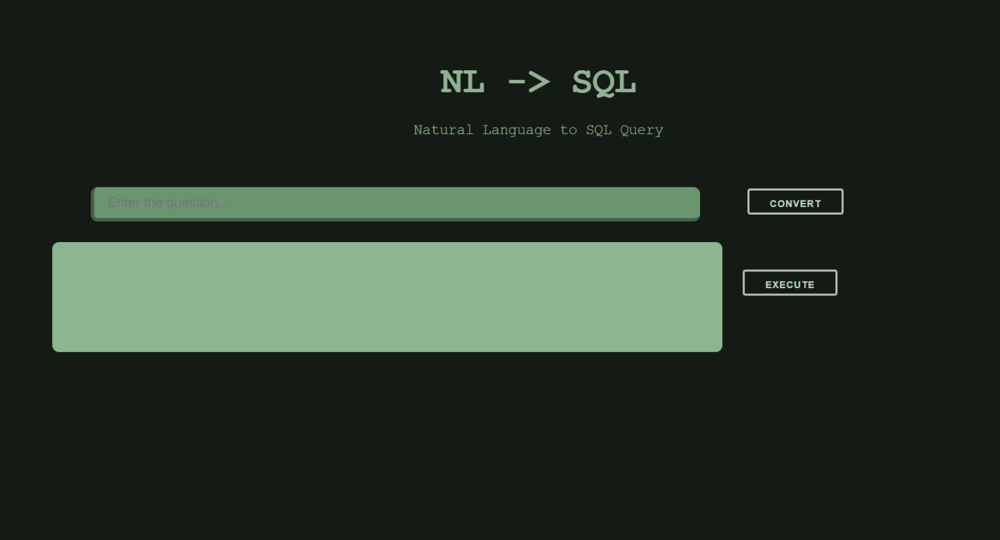

# Natural-Language-to-SQL-Query
Converting a natural language sentence to an SQL query using NLP and LSTM

# Working
Enter a question regarding the database in english language. The 'Convert' button runs this sentence through 
NLP parser -> network of decision making clauses -> LSTM models -> return the converted SQL query.

The 'Execute' button will execute this generated query, fetch the result from the MySQL database and display the table to the user.

